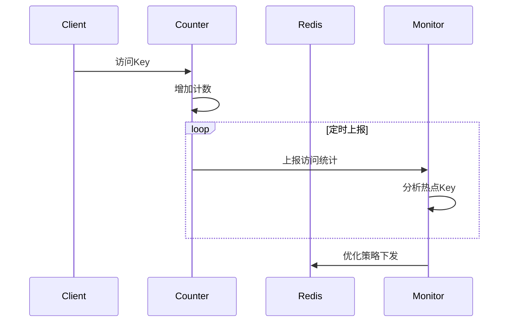
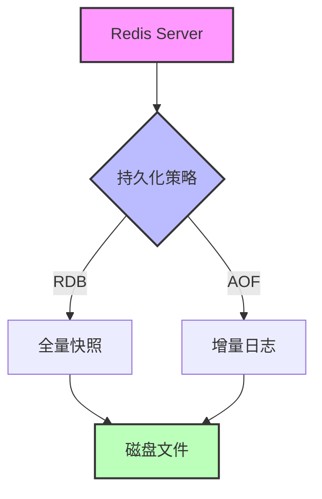

## 1. 热点Key探测（客户端埋点）

### 1.1 技术原理

热点Key探测的核心是通过客户端埋点统计来识别访问频率异常高的键值，从而进行针对性优化。



### 1.2 实践应用

在生产环境中，我们通常通过以下方式实现热点Key的探测：

```java
public class HotKeyDetector {
    private static final LoadingCache<String, AtomicLong> counter =
        CacheBuilder.newBuilder()
            .expireAfterWrite(1, TimeUnit.MINUTES)
            .build(new CacheLoader<String, AtomicLong>() {
                @Override
                public AtomicLong load(String key) {
                    return new AtomicLong(0);
                }
            });
    
    public static void recordAccess(String key) {
        counter.getUnchecked(key).incrementAndGet();
    }
    
    @Scheduled(fixedRate = 60000)
    public void reportHotKeys() {
        Map<String, Long> hotKeys = counter.asMap().entrySet().stream()
            .filter(e -> e.getValue().get() > threshold)
            .collect(Collectors.toMap(
                Map.Entry::getKey,
                e -> e.getValue().get()
            ));
        // 上报热点Key信息
        monitorService.report(hotKeys);
    }
}
```

### 1.3 异常处理

热点Key可能导致的问题及解决方案：

1. 缓存击穿：使用互斥锁或分布式锁
2. 缓存雪崩：设置随机过期时间
3. 缓存穿透：布隆过滤器拦截

### 1.4 优劣势分析

优势：
- 精准定位性能瓶颈
- 可实时调整策略
- 低侵入性

劣势：
- 额外的内存开销
- 统计精度与实时性的平衡

## 2. 多级缓存架构（LocalCache+Redis）

### 2.1 技术原理

多级缓存通过组合本地缓存和分布式缓存的优势，实现更高效的数据访问。


### 2.2 实践应用

使用Caffeine作为本地缓存，Redis作为二级缓存的实现示例：

```java
@Service
public class MultiLevelCache {
    private final Cache<String, Object> localCache = Caffeine.newBuilder()
        .expireAfterWrite(5, TimeUnit.MINUTES)
        .maximumSize(10_000)
        .build();
    
    @Autowired
    private RedisTemplate<String, Object> redisTemplate;
    
    public Object get(String key) {
        // 查询本地缓存
        Object value = localCache.getIfPresent(key);
        if (value != null) {
            return value;
        }
        
        // 查询Redis缓存
        value = redisTemplate.opsForValue().get(key);
        if (value != null) {
            // 回填本地缓存
            localCache.put(key, value);
            return value;
        }
        
        // 查询数据库
        value = queryDB(key);
        if (value != null) {
            // 同时写入两级缓存
            redisTemplate.opsForValue().set(key, value, 30, TimeUnit.MINUTES);
            localCache.put(key, value);
        }
        return value;
    }
}
```

### 2.3 异常处理

多级缓存架构中的常见问题：

1. 缓存一致性：采用更新模式（Cache-Aside、Write-Through等）
2. 并发更新：使用分布式锁
3. 缓存预热：系统启动时预加载热点数据

### 2.4 优劣势分析

优势：
- 显著降低延迟
- 减轻Redis负载
- 提高系统可用性

劣势：
- 增加系统复杂度
- 一致性维护成本高
- 内存资源消耗大

## 3. 持久化策略混合使用（RDB+AOF）

### 3.1 技术原理

RDB和AOF混合持久化模式结合了两种方式的优点，既保证数据安全性又兼顾性能。



### 3.2 实践应用

Redis配置示例：

```bash
# RDB配置
save 900 1      # 900秒内至少1个key变化
save 300 10     # 300秒内至少10个key变化
save 60 10000   # 60秒内至少10000个key变化

# AOF配置
appendonly yes
appendfsync everysec  # 每秒同步一次

# 混合持久化配置
aof-use-rdb-preamble yes
```

### 3.3 异常处理

持久化过程中的常见问题：

1. 磁盘空间不足：定期清理和监控
2. fork阻塞：控制实例大小，调整系统参数
3. AOF重写阻塞：适当调整重写触发机制

### 3.4 优劣势分析

优势：
- 数据可靠性高
- 恢复速度快
- 兼顾性能和安全

劣势：
- 占用更多磁盘空间
- 可能影响主进程性能
- 配置相对复杂

## 总结

本文详细介绍了Redis高阶应用中的三个关键特性：热点Key探测、多级缓存架构和混合持久化策略。通过合理运用这些特性，可以显著提升Redis在生产环境中的性能和可靠性。在实际应用中，需要根据具体场景和需求，选择合适的实现方案和配置参数。